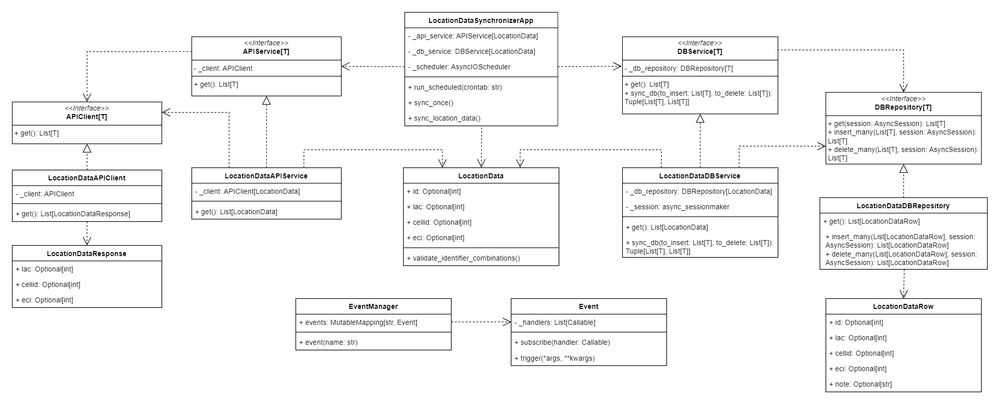

# Location Data synchronizer

Данный сервис синхронизирует список идентификаторов, получаемый из HTTP API с хранящимся в PotgreSQL
Модуль обращается в API по расписанию, указанному в конфигурационном файле, разбирает ответ, сравнивает
полученные данные с тем, что хранится в БД, и добавляет/удаляет требуемые строки.

## Архитектура



Архитектура сервиса является модульной и следует принципам SOLID. 
Функциональные модули разделены по зонам ответственности. Бизнес-логика зависит от абстракций, согласно принципу инверсии зависимостей.

В сервисе выделена бизнес-модель данных - ``LocationData``.
Эта модель содержит описание и правила валидации основных атрибутов.

Интерфейсы ``APIService`` > ``APIClient`` и ``DBService`` > ``DBRepository`` делают бизнес-логику независимой от конкретных реализаций API-клиентов и БД-репозиториев, соответственно, позволяя создавать неограниченное количество конкретных реализаций.

Логирование событий реализовано с использованием паттерна **Observer**, при этом события не изменяют функции, благодаря использованию паттерна **Декоратор**.

При разработке модуля для работы с БД использован "core"-подход SQLAlchemy ввиду необходимости единовременной вставки удаления большого количества записей >20000 строк. Тем не менее, для улучшения качества и читаемости кода, добавлен маппинг данных из строк БД в NamedTuple.

## Развертывание

### Конфигурирование

Необходимо предоставить файл конфигурации в формате, следующем представленному в примере ``.env.sample``

```bash
LOCATION_DATA_ENDPOINT_URL=http://host.docker.internal:8080/indexes  # URL эндпоинта API
AUTH_LOGIN=admin  # Логин Basic Auth
AUTH_PASSWORD=admin  # Пароль Basic Auth
SCHEDULE=* * * * *  # Расписание в формате cron

POSTGRES_USER=postgres  # Имя пользователя postgres
POSTGRES_PASSWORD=root  # Пароль
POSTGRES_HOST=host.docker.internal  # Хост
POSTGRES_PORT=5432  # Порт
POSTGRES_DB=location_data_db  # Имя базы данных
```

### Сборка образа

```bash
docker build -t location_data_synchronizer:latest .   
```

### Запуск контейнера

При запуске контейнера можно указать путь к конфигурационному файлу внутри контейнера (значение по умолчанию: ``.env``). При этом рекомендуется сделать mount этого конфигурационного файла для избежания повторной сборки контейнера при изменении конфигурации.

```bash
docker run -it -v "C:\Users\egoru\_work\location_data_synchronizer\.env:/location_data_synchronizer/.env" location_data_synchronizer:latest ".env"
```

## Описание модулей

- ``core``
- - ``app.py`` содержит класс `LocationDataSynchronizerApp`. Он использует APIService и DBService для взаимодействия с API и базой данных.
Содержит основной цикл, который периодически запускает метод синхронизации,
согласно предоставленному расписанию.
- - ``events.py`` содержит классы `Event` и `EventManager`. Event может использоваться для выполнения сайд-эффектов для функций или методов. EventManager содержит классовую переменную, содержащую маппинг {str: Event}. Предоставляет декоратор ``@event``, с помощью которого можно обернуть функцию, зарегистрировав событие.
- - ``models.py`` содержит описание бизнес-модели данных `LocationData` и правила валидации.
- ``api``
- - ``base.py`` содержит базовый класс `APIClient`
- - ``client.py`` содержит класс `LocationDataAPIClient` - реализацию конкретного API-клиента.
- - ``response.py`` содержит класс `LocationDataResponse` - описание ответа API
- ``db``
- - ``session.py`` содержит фабрику сессий
- - ``repositories``
- - - ``base.py`` содержит базовый класс `DBRepository`
- - - ``location_data.py`` содержит SQLAlchemy-репозиторий. Класс ``LocationData`` предоставляет функциональность для взаимодействия с базой данных. 
Этот репозиторий создан с использованием классического **императивного** стиля. Для этого решения есть несколько причин: 
- - - 1) Взаимодействие с базой данных должно быть оптимизировано из-за необходимости массовой вставки и удаления данных.
- - - 2) Полный контроль над созданием операторов и их выполнением. Использование массового удаления и вставки быстрее,
чем вставка по шаблону ORM Unit of Work.
- - - 3) Использование ORM снижает производительность в т.ч. из-за использования identity mapping.
- - ``tables`` - содержит описание таблицы `location_data` и модель записи - namedtuple `LocationDataRow`
- ``services``
- - ``api``
- - - ``base.py`` содержит базовый класс `APIService`. Каждый конкретный сервис может работать с любой реализацией ``APIClient``.
- - - ``location_data.py`` содержит класс `LocationDataAPIService` - конкретную реализацию API-сервиса.
- - ``db``
- - - ``base.py`` содержит базовый класс `DBService`. Каждый конкретный сервис может работать с любой реализацией ``DBRepository``
- - - ``location_data.py`` содержит класс `LocationDataDBService` - конкретную реализацию БД-сервиса. Реализует метод ``sync_db``, который, обращаясь ко внутренним методам репозитория, в рамках одной транзакции вставляет и удаляет записи в БД.
- ``utils`` 
- - ``event_logger.py`` содержит класс, объединяющий в себе "предустановленные" функции для логирования событий (см. events.py)
- - ``logger.py`` содержит фабрику логгеров. В качестве обработчика используется `QueueHandler`, что позволяет избежать блокировки потока выполнения при выводе большого количества строк лога на `stdout`.
- ``config.py`` содержит модели конфигурации приложения. Использует LRU кэш для доступа к файлу конфигурации.
- ``main.py`` является точкой входа - в нем создаются экземпляры клиентов, сервисов и приложения. Дополнительно, в нем можно "накинуть" логгеры на события.